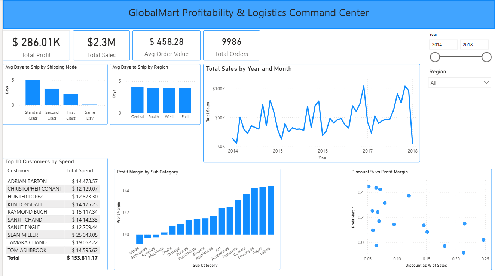

# 🛒 GlobalMart Retail Intelligence Pipeline
 
An end-to-end data engineering project simulating a modern enterprise retail analytics stack — built with Databricks, PySpark, Delta Lake (Medallion Architecture), and Power BI.
 
## 📋 Project Overview
 
**Client:** GlobalMart Inc. (Fictitious Retail Giant)
**Role:** Junior Data Engineer
**Engagement Lead:** Chris Gambill
 
GlobalMart previously compiled sales spreadsheets manually at the end of every month. This 30-day latency prevented the supply chain team from reacting to shipping delays and the marketing team from identifying high-value customers in real time.
 
This project builds an end-to-end data pipeline that ingests raw sales data, cleans and standardises it, and produces a Gold-layer dimensional model powering a Power BI dashboard — with zero manual effort.
 
## 📊 Final Dashboard
 

 
The dashboard answers the three business questions the project was built to solve, plus additional insight visuals added during the build (see [Key Design Decisions](#-key-design-decisions)).
 
| # | Business Question | Visual |
|---|---|---|
| 1 | **Profitability** — Which Product Sub-Categories have the lowest profit margins? | Sorted bar chart, Profit Margin by Sub-Category |
| 2 | **Logistics Efficiency** — What is the Average Days to Ship per Region? | Bar chart, Avg Days to Ship by Region |
| 3 | **Customer Value** — Who are the Top 10 Customers by total spend? | Ranked table |
 
**Required KPI:** Total Profit, formatted as currency, displayed at the top of the dashboard.
 
**Additional visuals built beyond the brief:**
- KPI row — Total Sales, Total Orders, Avg Order Value (context for the Total Profit figure)
- Discount % vs Profit Margin scatter — surfaces which sub-categories are being discounted into unprofitability
- Avg Days to Ship by Shipping Mode — logistics bottleneck view by carrier tier, not just region
- Total Sales by Year and Month — trend line, since none of the required visuals show change over time
See [DATA_DICTIONARY.md](DATA_DICTIONARY.md) for full column-level schema of every table.
 
## 🏗️ Technical Architecture
 
```
CSV Source (Kaggle Superstore)
        │
        ▼
┌──────────────┐
│  BRONZE LAYER │  Raw ingestion → Delta Tables (with ingest metadata)
└──────────────┘
        │
        ▼
┌──────────────┐
│  SILVER LAYER │  Cleaned, deduplicated, validated, business-friendly schema
└──────────────┘
        │
        ▼
┌──────────────┐
│   GOLD LAYER  │  Star Schema — Fact & Dimension tables for reporting
└──────────────┘
        │
        ▼
┌──────────────┐
│   POWER BI    │  Dashboard → Profitability, Logistics, Customer Value KPIs
└──────────────┘
```
 
| Layer | Tool / Engine |
|---|---|
| Ingestion | Databricks Free Edition + PySpark |
| Processing | Apache Spark (PySpark) |
| Storage | Delta Lake (Medallion Architecture) |
| Visualisation | Power BI Desktop (Import Mode via Partner Connect) |
 
## 📦 Dataset
 
**Source:** [Superstore Dataset Final — Kaggle](https://www.kaggle.com/datasets/vivek468/superstore-dataset-final)
 
## 🧠 Key Design Decisions
 
These are the judgment calls made during the build, and the reasoning behind them:
 
- **Geography as a degenerate dimension, not a full SCD2 table.** Geography was initially modeled as a Slowly Changing Dimension (Type 2), but this dataset has no actual geography changes over time — that added complexity without adding value, and was producing row duplication in the fact table from overlapping dimension versions. `region` is instead carried as a flat degenerate attribute directly on `fact_sales`.
- **`discount_amount` and `gross_sales` stored as additive facts, not the raw discount rate.** Discount rates (percentages) can't be summed meaningfully across rows — storing the calculated dollar amounts instead means they aggregate correctly at any level of a report.
- **Profit margin and unit price computed as DAX measures, not stored columns.** Both are ratios; storing them as physical columns would invite incorrect averaging in Power BI. They're instead computed live from summed profit/sales.
- **`postal_code` typed as `STRING`, not `INT`.** US zip codes with leading zeros (e.g. Boston, `02101`) would silently lose their leading digit if stored as an integer.
- **Customer and Product remain full SCD Type 2 dimensions**, tracked via a SHA-256 hash of their business attributes, with `valid_from`/`valid_to`/`is_current_flag` columns and a Delta `MERGE` that expires and re-inserts changed records.
- **Full overwrite on each gold-layer run, not incremental merge.** Since the source is a static, one-time CSV extract, a full overwrite on each run is the simplest correct approach. In a production system with a growing order feed, this would be replaced with an incremental `MERGE` on `order_id` instead — which the Bronze/Silver `sales` load already does via `whenNotMatchedInsertAll`/`whenMatchedUpdateAll`.
## 🚀 Getting Started
 
### Prerequisites
 
- [ ] Databricks Free Edition — [Sign Up](https://login.databricks.com/signup)
- [ ] Microsoft Power BI Desktop — [Download](https://www.microsoft.com/en-us/download/details.aspx?id=58494) (Windows only)
- [ ] Kaggle Account — [Sign Up](https://www.kaggle.com/) to download the dataset
- [ ] Git / GitHub
### Running the Pipeline
 
1. Create `bronze`, `silver`, and `gold` catalogs in Databricks
2. Upload `Sample - Superstore.csv` to a Volume under `bronze.superstore`
3. Run `notebooks/bronze/ingest_to_bronze.ipynb`
4. Run the silver notebooks: `sales_silver.ipynb`, `customer_silver.ipynb`, `products_silver.ipynb`
5. Run the gold notebooks: `gold_dim_customer.ipynb`, `gold_dim_product.ipynb`, `gold_dim_date.ipynb`, then `gold_fact_sales.ipynb` last (it depends on the dimension tables)
6. Connect Power BI Desktop to the Gold catalog via Databricks Partner Connect
7. Open `powerbi/globalmart_dashboard.pbix`
## 📁 Repository Structure
 
```
retail-globalmart-databricks/
│
├── notebooks/
│   ├── bronze/
│   │   └── ingest_to_bronze.ipynb
│   ├── silver/
│   │   ├── sales_silver.ipynb
│   │   ├── customer_silver.ipynb
│   │   └── products_silver.ipynb
│   └── gold/
│       ├── gold_dim_customer.ipynb
│       ├── gold_dim_product.ipynb
│       ├── gold_dim_date.ipynb
│       └── gold_fact_sales.ipynb
│
├── data/
│   └── Sample - Superstore.csv
│
├── powerbi/
│   └── globalmart_dashboard.pbix
│
├── globalmart_dashboard.png
├── DATA_DICTIONARY.md
└── README.md
```
 
## 🏆 Milestone Tracker
 
| Phase | Deliverable | Status |
|---|---|---|
| 01 | Ingestion Pipeline (Bronze) | ✅ Complete |
| 02 | Data Cleaning (Silver) | ✅ Complete |
| 03 | Dimensional Modelling (Gold) | ✅ Complete |
| 04 | Power BI Dashboard | ✅ Complete |
 
## 👤 About
 
Built by Emmanuel Yakubu ([github.com/emmanayoola](https://github.com/emmanayoola)) as a self-directed portfolio project.
